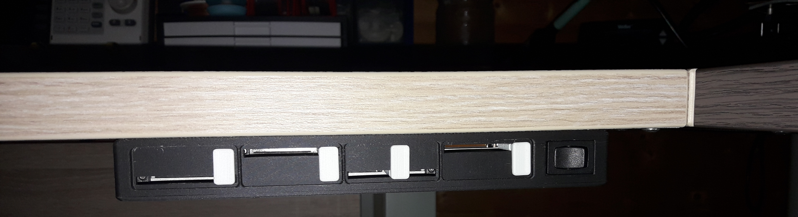
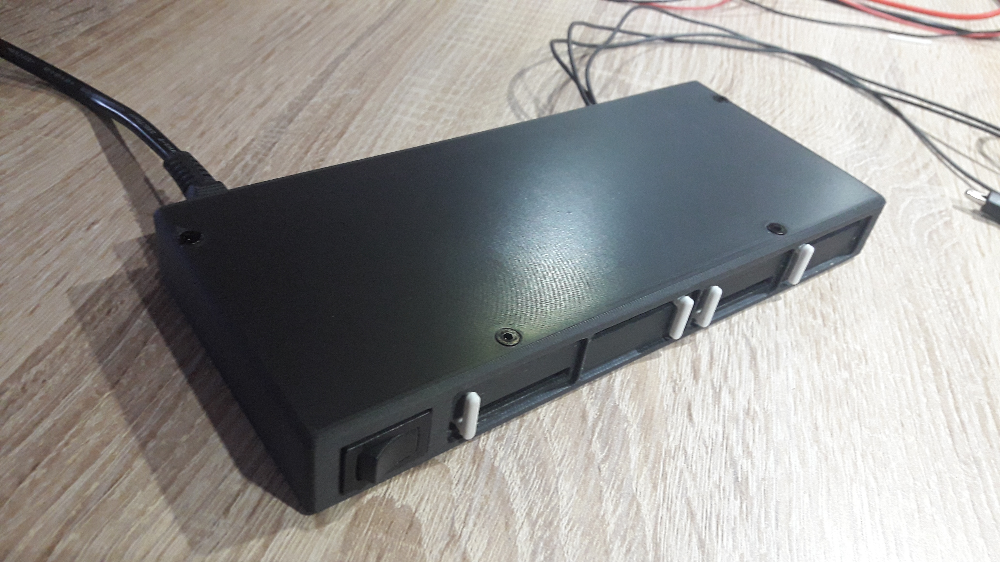
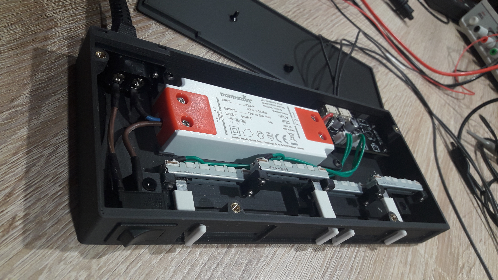
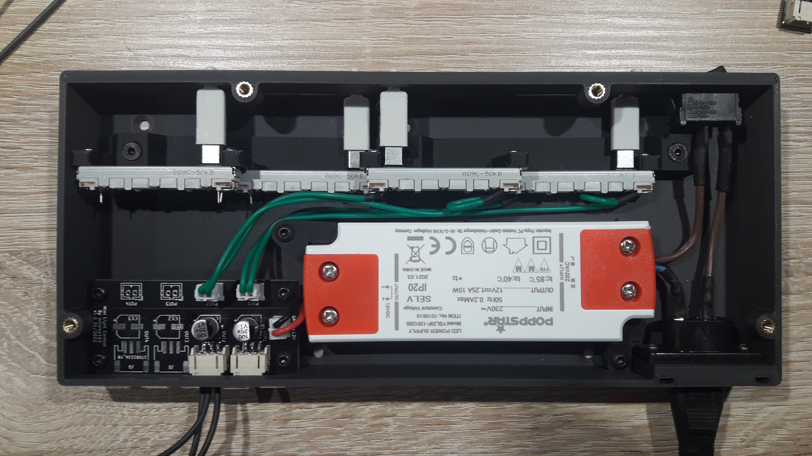

# Mini light: Control box
 
Another view with a slider (control_box-AsPotsCap) in v1:
 
## How to build
### List of items to found
- 1x IEC320 C7 cable.
- 1x IEC320 C7 connecter: [Amazon](https://www.amazon.fr/gp/product/B08TWM1LQ6/ref=ppx_yo_dt_b_asin_title_o00_s00?ie=UTF8&psc=1) 
- 1x Toggle Swith 230V (Multicomp: MP004405): [Farnell](https://fr.farnell.com/multicomp-pro/mp004405/commut-spst-10a-250vac-noir-panneau/dp/3462082) 
- 1x 230V to 12V Power module: [Amazon](https://www.amazon.fr/gp/product/B0924XBMCF/ref=ppx_yo_dt_b_asin_title_o01_s00?ie=UTF8&th=1) 
- 1x to 4x 50K slide potentiometers (Alps Alpine: STRS30102K): [Farnell](https://fr.farnell.com/alps/strs30102k/potentiometre-slide-50k/dp/1191729) 
- Some wires: [Amazon](https://www.amazon.fr/gp/product/B07G72FZCR/ref=ppx_od_dt_b_asin_title_s00?ie=UTF8&psc=1), [Farnell](https://fr.farnell.com/lapp-kabel/0047001/fil-silicone-0-25mm-noir-100m/dp/1285908) , **Note**: For wires connected at sector power use appropriate wires, I don't sure that wire is usable for this!
- Some JST connectors, PH series: [Amazon](https://www.amazon.fr/gp/product/B07SN5DLWH/ref=ppx_od_dt_b_asin_title_s00?ie=UTF8&psc=1), **Note**: The box for SMT is unavailable now
- Some M3 threaded inser: [Amazon](https://www.amazon.fr/gp/product/B08BCRZZS3/ref=ppx_yo_dt_b_asin_title_o02_s00?ie=UTF8&psc=1)
- Some M3 Screws: [Amazon](https://www.amazon.fr/gp/product/B07ZF2SDW6/ref=ppx_yo_dt_b_asin_title_o00_s00?ie=UTF8&psc=1)
- Some M2 Screws and nut: [Amazon](https://www.amazon.fr/gp/product/B093BY1XJJ/ref=ppx_yo_dt_b_asin_title_o02_s00?ie=UTF8&psc=1)

### List of board to build
- 1x Mini light control board. See: [Elec/control/README.md](../../Elec/control/README.md) 

### List of 3D printed parts
- 1x control_box-AsPotsCap_v2 (or control_box-AsPotsCap)
- 1x control_box-control_box
- 1x control_box-control_box_lid
- 1x control_box-Fix1_Power_Supply
- 1x control_box-Fix2_Power_Supply
- 4x control_box-SupPot

All 3D parts in .stl format are in to **"stl"** folder. In the folder **"prusa-slicer"** you can found the project of prusa-slicer.

## Photos to help build
**Note**: One the photos below there are only two sliders connected and control_box-AsPotsCap is in v1.
 
 