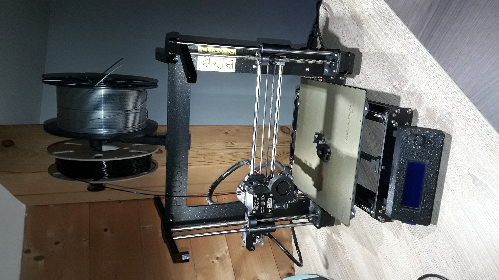
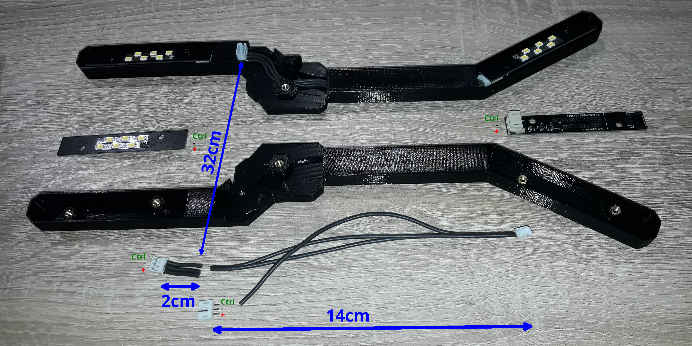

# Mini light: Light support for prusa mk3
 
**Note:** The fixing is inspired by the prject [LED Light Bar Prusa i3 MK2/MK3](https://www.printables.com/fr/model/3267-led-light-bar-prusa-i3-mk2mk3) 

## How to build
### List of items to found
- Some wires: [Amazon](https://www.amazon.fr/gp/product/B07G72FZCR/ref=ppx_od_dt_b_asin_title_s00?ie=UTF8&psc=1), [Farnell](https://fr.farnell.com/lapp-kabel/0047001/fil-silicone-0-25mm-noir-100m/dp/1285908) 
- Some JST connectors, PH series: [Amazon](https://www.amazon.fr/gp/product/B07SN5DLWH/ref=ppx_od_dt_b_asin_title_s00?ie=UTF8&psc=1)
- Some M3 threaded inser: [Amazon](https://www.amazon.fr/gp/product/B08BCRZZS3/ref=ppx_yo_dt_b_asin_title_o02_s00?ie=UTF8&psc=1)
- Some M3 Screws: [Amazon](https://www.amazon.fr/gp/product/B07ZF2SDW6/ref=ppx_yo_dt_b_asin_title_o00_s00?ie=UTF8&psc=1)

### List of board to build
- 4x light boards. See: [Elec/light/README.md](../../Elec/light/README.md) 

### List of 3D printed parts
- 1x support_light_l.stl
- 1x support_light_nut_r.stl
- 1x support_light_nut_l.stl
- 1x support_light_r.stl

All 3D parts in .stl format are in to **"stl"** folder. In the folder **"prusa-slicer"** you can found the project of prusa-slicer.

## Photo to help build
### List of wire to cut
- 6x 2cm
- 6x 14cm
- 3x 32cm

 
