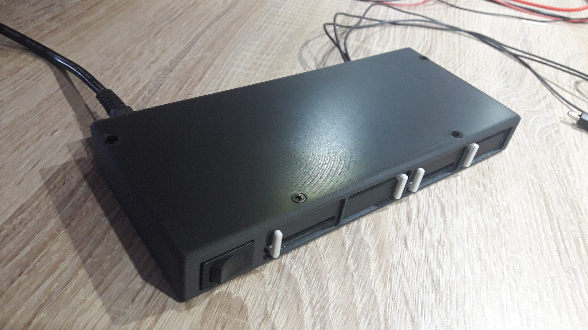

# Mini Light
This is a small brightness control for desktop / workbench  / ... 
This is composed several parts:
- The control box: To enclose the power supply/electronic and sliders control.
- Light support for shelf: To attach the lights under shelf.
- Light support for prusa: To attach the lights  on prusa 3D printer.
- Wire Ties: To attach some cables.

## Control box
 
For more detail see: [Meca/control_box/README.md](Meca/control_box/README.md) 

## Light support for shelf
 
For more detail see: [Meca/light_support_for_shelf/README.md](Meca/light_support_for_shelf/README.md) 

## Light support for prusa
Todo

## Wire Ties
Todo